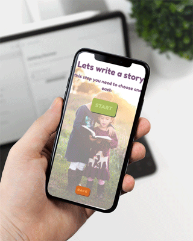

# Milestone2

##### Charlotte Aneriksson presents Milestone 2 
###### Storytelling app for kids
    

       

Visit the [storytelling app](https://charlotteaneriksson.github.io/my-milestone2/)

---

## UX & UI
### What it is
1. **Possibility to write your own good night story**
    * An app that makes it possible to create and read a story for a good night sleep or just to have a nice time while its raining. 
    * Choices are given to you, enviroment, character and item. This will after selection create a story.
### Whom its for
1. **The Parent**
2. **All parents, sibblings or other family**
3. **Children**
    * Childen from age 2-7 years

#### User
1. **Make time for both technologies and familytime**
    * As a parent, no need to have good imagination anymore. Just open the app, get your child to select their favourit animal, enviroments and items and just with a click you have a story to read together.
    * When the creativity lack after a hard day at work.
    * When you wanna use todays technologies but still wanna give what you got when you were a kid.
    * No need to think all screens are bad. They are not all bad, just use them for the right reasons.
2.  **The Child**
    * Learning to read.
    * Get activated in a calm, yet playful way. 
    * They wake up in the middle of the night and dont wanna wake up mom and dad, they can just read a story

#### Developer
1. **For fun**
    * Just for fun or for you own children. Create a game or other fun stuff you can later use with your kids or give away to others.
2. **To grow creativity**
    * Create color, graphic cartoons or just make up a game that doesnt excist.
3. **To practice JavaScript**
    * Maybe my JS can be written more simple? Or the logic can be written with other JS logic? 
4. **To practice mobileFirst**
    * Today most people visits the internet with their mobilephones. The statistics are very high, check it out [for Sweden](https://2017.svenskarnaochinternet.se/allmant-om-utvecklingen/internet-i-mobilen/)
    * The importance of mobilefirst is very great if you wanna grow the range of visitors or users.

### Design
1. **UX User Experience**
    * My UX is made to be simple and easy to understand even for the youngest of children useing the App. 
    * Photos are well thought out, they are there to create feelings and well thought out connections.
      * **bg1** 
      This is a laughing little happy boy. He reminds med of laughter and loads laughter. Pure happienss, that kind that only a kid has.
      * **bg2** 
      Two friends, two sibblings are together reading a story. The picture reminds me of building relationships and trust.
      * **bg3** 
      Reminds me and my brothers kids of a cosy cabbin built with cushions and bedsheets hihi. So cozy!
    * Along side with the pictures i chose to create vector graphic in Adobe Illustrator. Tried to create playful and simple graphics that every child could relate to somehow and the characters are created with a smile. Maybe a butterfly cant wear boots for us adults but for a child they can. Playful imagination is important.
2. **Colors** 
    

      
    

  * Orange
      This color will draw attention and might make a person feel enthusiasm, balance and wormth. Is is according to science a welcoming color.
     
    #e2985d
    

      
    

  * Purple
    Purple is the color of the devine. Back in the days it was a royal color that today might bring up feeling like royalty, spiritual, mysterious and intelligent.
     
    #7e557f
    

      
    

  * Green 
    Has a calming and refreshing effect and its the most kind to the eye. Is a symbol for nature and could induce feelings like analytical, calm, wealth and pure.  
    #adba60

3. **Fonts**
  * *font-family: 'Source Sans Pro', sans-serif;*
    * This font is used in the information text do to the more seriousness of that text. It's ment to be read by parents and its a font you usually see in instuctional texts.
  * *font-family: 'Fredoka One', cursive;*
    * This is the main font of the page. Its a font with roundness in style, eazy to read ability and its usually seen in kids books, games and apps do to its playfulness.

---

## Features 
1. #### Language choice
    * Possibility to choose to play the App in Swedish- or English mode, selected by flags
    * Heading circulates in both langugages 
2. Create a farytail by chooseing yourself who's going to be the main character
3.  
## Future features 

## Credit
### Photographers
  * All photographs are taken from [Unsplash](https://unsplash.com/).
It is free and you can use it in commercial use and for your own use. Credit isn't required but they like it when you do.
  * Background pic - Landing bg1 [Ben White](https://unsplash.com/photos/4K2lIP0zc_k)
  * Background pic - Bg2 [Ben White](https://unsplash.com/photos/EMZxDosijJ4)
  * Background pic - Bg3 [MILKOVÍ](https://unsplash.com/photos/FTNGfpYCpGM)
  * Background pic - Bg4 [Klim Sergeev](https://unsplash.com/photos/UYNH5VCsYPU)
 ### Vector-graphics
 * All vectors are created by [Charlotte Aneriksson](https://www.linkedin.com/in/charlotte-aneriksson-157345186/)

 ### Articles & Acknowledgements
  * Read about psuedo classes :not checked [in this article](https://stackoverflow.com/questions/8846075/css3-unchecked-pseudo-class)
  * Learned about nth:child in [Sara Copes](https://css-tricks.com/almanac/selectors/n/nth-child/) article. She also linkes to a great math explaination from the author [Chris Coyier](https://css-tricks.com/how-nth-child-works/) 
  * Learning and creating solutions with the help from [w3schools Library](https://www.w3schools.com/), mainly refreshed my knowledge about jQuery syntax here..
  * The book [HeadFirst Javascript](https://www.oreilly.com/library/view/head-first-javascript/9781449340124/) helped me with creating algoritms on paper first. Mapping the problem first..

  ### Audio 
1. Im getting most of my audio files from [Sound Jay](https://www.soundjay.com/index.html) 
   * It's a free soundeffect website. *Its free to use on websited and in projects but not allowed to spread as your own.* Read more about the licens on their website.
2. [FreeSound](https://freesound.org/people/Soughtaftersounds/) 
    * The *magic wand* sound effect that you'll hear white the story is created, comes with a CC - Attribution licens.

---

## Technologies
### Technologies used 
* Visual Studio Code - development environment with literally everything you need
  * Live server - Plugin from VS code, gives you live preview on your work
* Git & GitHub
  * Git - by Git trough VS code you can save your work in every step of the way. Also directly deploy your site to GitHub
  * GitHub - The git repository you create can be hosted and that way deployed here. Build and share your software and learn from others.
* Photos
  * Unsplash - Professional images to download and use for anything. Credit is not required but appreciated.  
  * Optimizing images - With [TinyPNG](https://tinypng.com/) you can simply optimize the loading time for your app/website if you have img files.
* Google fonts - Free library of approximately 900 fonts, Font do matter !
  * Linked from head tag in a stylesheet link. Do not use @import do to the negative impact it can have on the web pafe performance.
* Font Awesome - Similar to google fonts but more of font and icon based toolkit, available both for free and for a fee. 
  * Icons question-mark and cross

### Deployment
* Tools used for deployment
  * Visual Studio Code
  * Git & GitHub
* How I deployed my project
1. After final **git push** i loged into my GitHub account
2. Locate the right repository and choose **Settings**
3. Scroll down to **GitHub Pages** > **Source** and select **master branch**
4. Once selected its deployed. Copy **link** and paste into README.md 

---

## Validations, Testing & Adjustments 
 * Autoprefixers from - [this link](https://autoprefixer.github.io/)
  * 

 * Validation of [HTML5](https://validator.w3.org/)
  * 

 * Validation of [CSS3](https://jigsaw.w3.org/css-validator/)

 * Validation of [JS](https://codebeautify.org/)

 * Testing of Javascript - [JsHint](https://jshint.com/)

### Adjustments
* Original landingpage UX
  * Changed the original UX to a more understandable one for the youngest kids. Changed the buttons into flags.
  * Added a ? - button so that you can read about what it is and how it works. Good for the parent and maybe also good for older children or sibblings.
* Hiding content with jQuery
  * Hide the selection part before pressing start and hiding everything except the story when story is ready.
  * Do to: Users wish, two parents ask for this in case the kid were trying to scroll the screen while reading.

### Testing
1. Desktop & Laptop
  * All linkes where clicked and tested if they were working proparly
  * Browsertesting:
    * Chrome - Works perfectly and looks great
    * Edge - Works fine, looks great
    * Fireforx - Work like it should, looks good
    * Safari - On desktop it works fine, small issues in mobile
2. Iphone
  * Github link works perfectly, looks great
  * With Chrome it works perfectly and looks great.
  * With safari webbrowser there is some issue with closing button adn the css style 100vh 

## Bugs and Bugfixers
 * Bug with the vh on the ready-to write story part of the page
   * Solution was to add positioning with css
 * Slow sound on iphone when visiting the github through facebooklink, not visiting through github on chrome though 
  * still searching for solutions

---
